# AI Expense Intelligence Platform

AI Expense Intelligence Platform is a production-style distributed backend platform built using Spring Boot, FastAPI, PostgreSQL, Redis, Apache Kafka, Keycloak, Docker, Kubernetes, Helm, OpenTelemetry, Jaeger, Prometheus, Grafana, and the ELK stack.

The project simulates a real-world enterprise expense management system with AI-powered analytics and cloud-native backend engineering patterns.

The platform supports:

- User onboarding
- Organization management
- Organization member management
- Expense creation and persistence
- AI-based expense categorization
- AI spending insights
- AI anomaly detection
- Kafka event-driven audit logging
- Kafka retry and Dead Letter Topic handling
- WebSocket live expense notifications
- Redis caching
- Keycloak OAuth2/JWT authentication
- Prometheus metrics
- Grafana dashboards
- OpenTelemetry distributed tracing
- Jaeger trace visualization
- ELK centralized logging
- Kafka UI topic monitoring
- Dockerized local development
- Kubernetes deployment
- Helm-based deployment
- Terraform infrastructure scaffold

The main goal of this project is to demonstrate modern backend, distributed systems, observability, and cloud-native engineering concepts using a realistic production-style architecture.

---

# Tech Stack

## Backend

- Java 21
- Spring Boot
- Spring Web
- Spring Data JPA
- Spring Security
- OAuth2 Resource Server
- Spring Kafka
- Spring WebSocket
- Spring Boot Actuator
- Micrometer
- Maven
- Lombok
- Bean Validation
- OpenAPI / Swagger

## AI Microservice

- Python
- FastAPI
- Uvicorn
- OpenAPI / Swagger
- OpenTelemetry instrumentation

## Database

- PostgreSQL

## Cache

- Redis

## Messaging

- Apache Kafka
- Kafka retry handling
- Kafka Dead Letter Topic
- Kafka UI

## Authentication

- Keycloak
- OAuth2
- JWT Bearer Tokens
- Role-based access control

## Observability

- OpenTelemetry
- Jaeger
- Prometheus
- Grafana
- ELK Stack
- Logstash
- Elasticsearch
- Kibana

## Infrastructure

- Docker
- Docker Compose
- Kubernetes
- Helm
- Terraform scaffold

---

# Current Enterprise Features

## User Module

- Create user
- Fetch users
- User persistence in PostgreSQL
- Unique user identity using UUID
- Validation for user payloads

## Organization Module

- Create organization
- Fetch organizations
- Organization-level expense isolation
- Multi-tenant style data structure

## Organization Member Module

- Add users as organization members
- Role assignment inside an organization
- Member validation before expense creation

## Expense Module

- Create expenses under organizations
- Store expense title, description, amount, category, date, and creator
- Link expenses to users and organizations
- Persist expense data in PostgreSQL
- Publish expense-created event to Kafka

## AI Analytics Module

- AI category preview
- AI anomaly check
- AI spending insights
- AI service fallback using Resilience4j
- Circuit breaker and retry support for AI service calls

## Audit Log Module

- Kafka-based expense event consumption
- Audit log persistence in PostgreSQL
- Audit trail for expense-created events
- Event timestamp tracking
- Kafka retry and DLT support

## Notification Module

- WebSocket-based live notifications
- Organization-specific expense notification topics
- Real-time message delivery after expense creation

## Kafka Module

- Expense event publishing
- Expense event consumption
- Retry handler
- Dead Letter Topic
- DLT consumer
- Kafka UI monitoring

## Security Module

- Keycloak OAuth2 authentication
- JWT-based authorization
- Stateless authentication
- OAuth2 Resource Server
- Controller-level method security support
- Public health and documentation endpoints

## Observability Module

- OpenTelemetry Java agent for Spring Boot
- OpenTelemetry FastAPI instrumentation
- Jaeger trace visualization
- Prometheus metrics scraping
- Grafana dashboard support
- ELK centralized logging
- Logstash TCP log ingestion
- Kibana log exploration

## Platform Features

- Docker Compose full-stack setup
- Kubernetes deployment manifests
- Helm deployment chart
- Terraform GCP infrastructure scaffold
- Production-oriented environment configuration
- Local and containerized execution support

---

# System Architecture

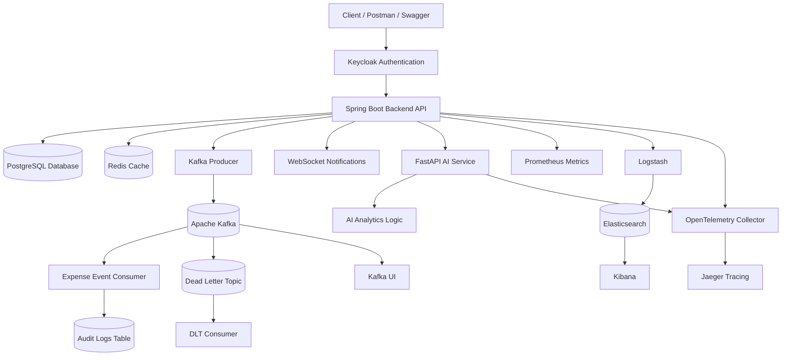

---

# Microservice Architecture

The platform contains two main application services.

## Spring Boot Backend

The Spring Boot service is the main backend API. It handles:

- Authentication enforcement
- User management
- Organization management
- Expense management
- Kafka publishing
- Kafka consuming
- Audit logs
- WebSocket notifications
- Metrics
- Tracing
- Integration with FastAPI

## FastAPI AI Service

The FastAPI service handles AI-related expense intelligence features:

- Expense categorization
- Anomaly detection
- Spending insights

The backend communicates with the AI service over HTTP.

---

# Event-Driven Architecture

Kafka is used for asynchronous event processing.

## Expense Event Flow

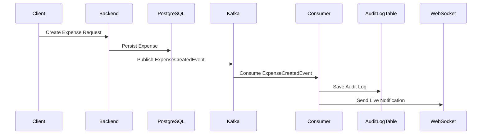

---

# Kafka Retry and Dead Letter Topic Flow

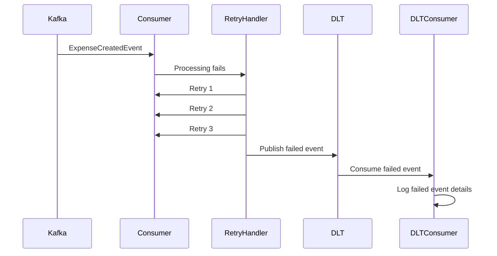

The project includes production-style failure handling for Kafka consumers.

If a Kafka message cannot be processed successfully, the system retries the event and then sends it to the dead letter topic.

---

# AI Service Resilience Flow

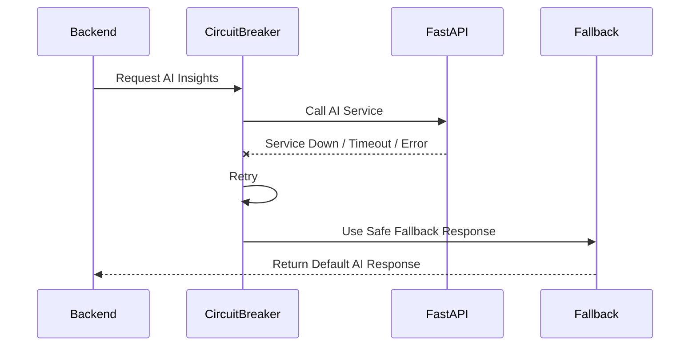

The backend does not crash if the AI service is unavailable.

Instead, it returns safe fallback values using Resilience4j.

---

# Observability Architecture

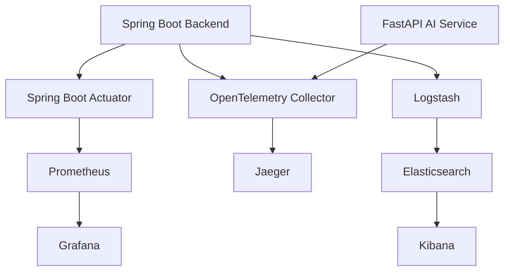

The platform includes metrics, logs, and traces.

This gives a complete observability setup similar to production systems.

---

# Project Structure

```text
ai-expense-intelligence-platform/
│
├── backend-springboot/
│   ├── src/main/java/com/example/ai_expense_backend/
│   │   ├── config/
│   │   ├── controller/
│   │   ├── dto/
│   │   ├── entity/
│   │   ├── event/
│   │   ├── exception/
│   │   ├── repository/
│   │   ├── service/
│   │   └── AiExpenseBackendApplication.java
│   │
│   ├── src/main/resources/
│   │   ├── application.properties
│   │   └── application-prod.yml
│   │
│   ├── Dockerfile
│   └── pom.xml
│
├── ai-service-fastapi/
│   ├── app/
│   │   ├── api/
│   │   └── main.py
│   ├── Dockerfile
│   └── requirements.txt
│
├── helm/
│   └── ai-expense-platform/
│
├── k8s/
│
├── keycloak/
│   └── expense-realm.json
│
├── logstash/
│   └── logstash.conf
│
├── otel/
│   └── otel-collector-config.yaml
│
├── prometheus/
│   └── prometheus.yml
│
├── terraform/
│
├── screenshots/
│
├── docker-compose.yml
└── README.md
```

---

# Database Design

## app_users Table

```text
app_users
├── id
├── full_name
├── email
├── phone_number
├── created_at
```

## organizations Table

```text
organizations
├── id
├── name
├── description
├── created_at
```

## organization_members Table

```text
organization_members
├── id
├── organization_id
├── user_id
├── role
├── joined_at
```

## expenses Table

```text
expenses
├── id
├── organization_id
├── created_by
├── title
├── description
├── amount
├── category
├── expense_date
├── created_at
```

## audit_logs Table

```text
audit_logs
├── id
├── event_type
├── reference_id
├── organization_id
├── user_id
├── message
├── created_at
```

---

# Security

The platform uses Keycloak OAuth2 authentication with JWT Bearer tokens.

## Security Features

- OAuth2 Resource Server
- JWT validation
- Role-based authorization
- Stateless authentication
- Secure REST APIs
- Keycloak realm import
- Public health endpoints
- Secured business APIs

## Keycloak Realm

```text
expense-realm
```

## Keycloak Client

```text
expense-api
```

## Test Users

```text
Admin User:
username: expenseadmin
password: password

Member User:
username: expensemember
password: password
```

## Roles

```text
ADMIN
MEMBER
```

---

# REST API Overview

# Health APIs

## Backend Health

```http
GET /api/v1/health
```

## FastAPI Health

```http
GET /health
```

---

# Authentication API

## Generate Access Token

```http
POST /realms/expense-realm/protocol/openid-connect/token
```

---

# User APIs

## Create User

```http
POST /api/v1/users
```

## Get Users

```http
GET /api/v1/users
```

---

# Organization APIs

## Create Organization

```http
POST /api/v1/organizations
```

## Get Organizations

```http
GET /api/v1/organizations
```

---

# Organization Member APIs

## Add Member To Organization

```http
POST /api/v1/organizations/{organizationId}/members
```

---

# Expense APIs

## Create Expense

```http
POST /api/v1/organizations/{organizationId}/expenses
```

---

# Analytics APIs

## Expense Summary

```http
GET /api/v1/organizations/{organizationId}/analytics/summary
```

## Category Breakdown

```http
GET /api/v1/organizations/{organizationId}/analytics/category-breakdown
```

## AI Spending Insights

```http
GET /api/v1/organizations/{organizationId}/analytics/ai-insights
```

---

# AI Expense APIs

## Preview Category

```http
POST /api/v1/organizations/{organizationId}/expenses/preview-category
```

## Anomaly Check

```http
POST /api/v1/organizations/{organizationId}/expenses/anomaly-check
```

## Auto Categorize

```http
POST /api/v1/organizations/{organizationId}/expenses/auto-categorize
```

---

# Audit Log APIs

## Get Audit Logs

```http
GET /api/v1/audit-logs
```

---

# Example API Requests

# Generate Admin Token

```bash
curl -X POST "http://localhost:8081/realms/expense-realm/protocol/openid-connect/token" \
  -H "Content-Type: application/x-www-form-urlencoded" \
  -d "client_id=expense-api" \
  -d "username=expenseadmin" \
  -d "password=password" \
  -d "grant_type=password"
```

---

# Create User

```bash
curl -X POST "http://localhost:8080/api/v1/users" \
  -H "Authorization: Bearer ACCESS_TOKEN" \
  -H "Content-Type: application/json" \
  -d '{
        "fullName": "Final Demo User",
        "email": "final-demo-user@example.com",
        "phoneNumber": "+491111111170"
      }'
```

---

# Create Organization

```bash
curl -X POST "http://localhost:8080/api/v1/organizations" \
  -H "Authorization: Bearer ACCESS_TOKEN" \
  -H "Content-Type: application/json" \
  -d '{
        "name": "Final Demo Organization",
        "description": "Final backend demo"
      }'
```

---

# Add Organization Member

```bash
curl -X POST "http://localhost:8080/api/v1/organizations/{organizationId}/members" \
  -H "Authorization: Bearer ACCESS_TOKEN" \
  -H "Content-Type: application/json" \
  -d '{
        "userId": "USER_ID",
        "role": "ADMIN"
      }'
```

---

# Create Expense

```bash
curl -X POST "http://localhost:8080/api/v1/organizations/{organizationId}/expenses" \
  -H "Authorization: Bearer ACCESS_TOKEN" \
  -H "Content-Type: application/json" \
  -d '{
        "title": "Final Docker Expense",
        "description": "Testing full backend platform",
        "amount": 199.99,
        "category": "FOOD",
        "expenseDate": "2026-05-18",
        "createdByUserId": "USER_ID"
      }'
```

---

# Get Analytics Summary

```bash
curl -X GET "http://localhost:8080/api/v1/organizations/{organizationId}/analytics/summary" \
  -H "Authorization: Bearer ACCESS_TOKEN"
```

---

# Get Category Breakdown

```bash
curl -X GET "http://localhost:8080/api/v1/organizations/{organizationId}/analytics/category-breakdown" \
  -H "Authorization: Bearer ACCESS_TOKEN"
```

---

# Get AI Spending Insights

```bash
curl -X GET "http://localhost:8080/api/v1/organizations/{organizationId}/analytics/ai-insights" \
  -H "Authorization: Bearer ACCESS_TOKEN"
```

---

# Get Audit Logs

```bash
curl -X GET "http://localhost:8080/api/v1/audit-logs" \
  -H "Authorization: Bearer ACCESS_TOKEN"
```

---

# Redis Caching

Redis is used to support caching for repeated backend reads.

## Cache Use Cases

- Frequently accessed organization data
- Repeated analytics reads
- Performance optimization for service calls

Redis improves response time and reduces unnecessary database access.

---

# Kafka Event-Driven Audit Logging

Kafka is used to publish expense-created events.

## Published Event

```text
EXPENSE_CREATED
```

## Topic

```text
expense-created-events
```

## Dead Letter Topic

```text
expense-created-events-dlt
```

## Consumer Responsibility

The Kafka consumer listens to expense-created events and persists them as audit logs in PostgreSQL.

The system also sends WebSocket notifications after processing the event.

---

# WebSocket Live Notifications

The backend sends real-time notifications when expenses are created.

## WebSocket Endpoint

```text
/ws
```

## Topic Format

```text
/topic/organizations/{organizationId}/expenses
```

## Example Notification

```json
{
  "type": "EXPENSE_CREATED",
  "expenseId": "UUID",
  "organizationId": "UUID",
  "userId": "UUID",
  "title": "Final Docker Expense",
  "amount": 199.99,
  "category": "FOOD",
  "message": "Expense created: Final Docker Expense | amount=199.99 | category=FOOD",
  "timestamp": "2026-05-18T10:03:19.736116235Z"
}
```

---

# Resilience4j Fault Tolerance

The Spring Boot backend uses Resilience4j for AI service calls.

## Implemented Patterns

- Retry
- Circuit breaker
- Fallback response

## Why It Matters

If the FastAPI AI service is down, the backend still responds safely instead of failing.

Example fallback behavior:

```text
AI insights temporarily unavailable.
Fallback response returned.
```

---

# OpenTelemetry Distributed Tracing

The platform supports distributed tracing for:

- Spring Boot backend
- FastAPI AI service

## Trace Flow

```text
Client Request → Spring Boot → FastAPI AI Service → Response
```

## Jaeger UI

```text
http://localhost:16686
```

Expected services:

```text
ai-expense-backend
ai-expense-ai-service
```

---

# Prometheus Monitoring

Prometheus scrapes Spring Boot Actuator metrics.

## Prometheus UI

```text
http://localhost:9090
```

Useful PromQL queries:

```promql
up
```

```promql
http_server_requests_seconds_count
```

```promql
jvm_memory_used_bytes
```

```promql
process_cpu_usage
```

```promql
system_cpu_usage
```

```promql
hikaricp_connections_active
```

---

# Grafana Dashboards

Grafana visualizes metrics collected by Prometheus.

## Grafana UI

```text
http://localhost:3000
```

Default login:

```text
username: admin
password: admin
```

## Dashboard Metrics

- JVM memory usage
- HTTP request count
- CPU usage
- Active database connections
- Request latency
- Service health

---

# ELK Centralized Logging

The backend sends logs to Logstash, which forwards them to Elasticsearch.

Kibana is used to inspect and search logs.

## Kibana UI

```text
http://localhost:5601
```

## Elasticsearch Index Pattern

```text
ai-expense-backend-logs-*
```

---

# Kafka UI

Kafka UI is used to visually inspect Kafka topics and messages.

## Kafka UI URL

```text
http://localhost:8090
```

## Topics

```text
expense-created-events
expense-created-events-dlt
```

Kafka UI helps verify:

- Published events
- Dead letter messages
- Consumer groups
- Offsets
- Topic health

---

# Local Development Setup

# 1. Clone Repository

```bash
git clone https://github.com/siddhants4000/ai-expense-intelligence-platform.git

cd ai-expense-intelligence-platform
```

---

# 2. Start Complete Infrastructure

```bash
docker compose up -d
```

Verify running containers:

```bash
docker ps
```

---

# 3. Verify Backend Health

```bash
curl http://localhost:8080/api/v1/health
```

---

# 4. Verify AI Service Health

```bash
curl http://localhost:8000/health
```

---

# Application URLs

| Service | URL |
|---|---|
| Spring Boot Backend | http://localhost:8080 |
| Spring Boot Swagger UI | http://localhost:8080/swagger-ui.html |
| FastAPI AI Service | http://localhost:8000 |
| FastAPI Docs | http://localhost:8000/docs |
| Keycloak | http://localhost:8081 |
| Kafka UI | http://localhost:8090 |
| Prometheus | http://localhost:9090 |
| Grafana | http://localhost:3000 |
| Kibana | http://localhost:5601 |
| Jaeger | http://localhost:16686 |
| Elasticsearch | http://localhost:9200 |

---

# Docker Compose Services

The Docker Compose stack includes:

- PostgreSQL
- Redis
- Keycloak
- Zookeeper
- Kafka
- Kafka UI
- Spring Boot backend
- FastAPI AI service
- Prometheus
- Grafana
- Elasticsearch
- Logstash
- Kibana
- Jaeger
- OpenTelemetry Collector

---

# Kubernetes Deployment

The project supports Kubernetes deployment.

## Kubernetes Features

- Backend deployment
- AI service deployment
- PostgreSQL deployment
- Redis deployment
- Kafka deployment
- Keycloak deployment
- Services for internal communication
- Namespace-based isolation

## Verify Kubernetes Resources

```powershell
kubectl get all -n ai-expense
```

---

# Helm Deployment

The project includes Helm charts for simplified Kubernetes deployment.

## Helm Chart Location

```text
helm/ai-expense-platform
```

## Helm Features

- Parameterized deployments
- Reusable Kubernetes templates
- Centralized values.yaml configuration
- Service and deployment templates
- Cleaner Kubernetes release management

## Install Helm Release

```powershell
helm install ai-expense ./helm/ai-expense-platform -n ai-expense --create-namespace
```

## Upgrade Helm Release

```powershell
helm upgrade ai-expense ./helm/ai-expense-platform -n ai-expense
```

## Uninstall Helm Release

```powershell
helm uninstall ai-expense -n ai-expense
```

---

# Terraform Infrastructure Scaffold

The project includes a Terraform scaffold for future GCP deployment.

## Terraform Location

```text
terraform/
```

## Terraform Files

```text
terraform/
├── main.tf
├── variables.tf
├── outputs.tf
└── terraform.tfvars.example
```

## Terraform Commands

```powershell
cd terraform

terraform init

terraform validate
```

Terraform currently prepares infrastructure structure for cloud deployment and can be extended for GCP Artifact Registry, Cloud Run, networking, and managed services.

---

# CI/CD

The project can be extended with GitHub Actions CI/CD.

Recommended CI pipeline steps:

- Build Spring Boot backend
- Build FastAPI service
- Run tests
- Build Docker images
- Lint Helm charts
- Render Helm templates
- Validate Terraform files

---

# Screenshots

Create a folder in the project root:

```text
screenshots/
```

Use the following exact screenshot names.

## Spring Boot Swagger UI

```text
screenshots/swagger-ui.png
```

```md
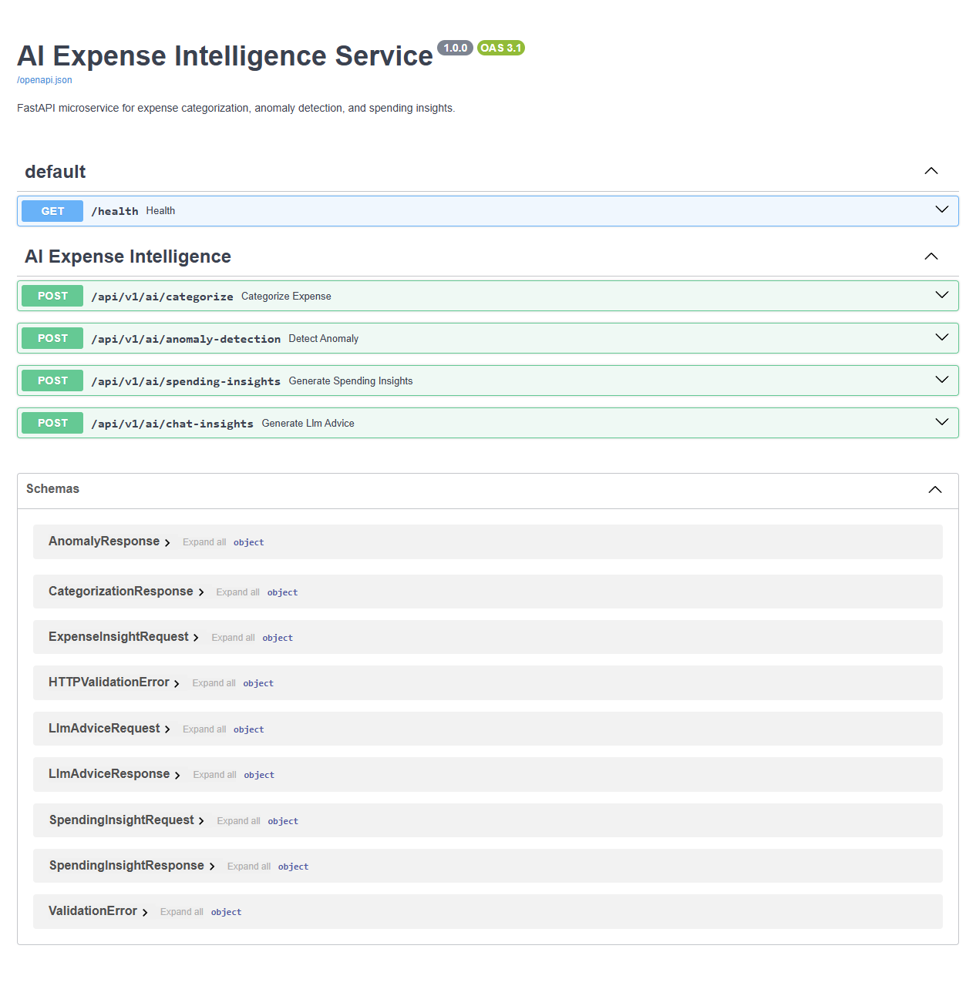
```

## FastAPI Docs

```text
screenshots/fastapi-docs.png
```

```md

```

## Docker Containers

```text
screenshots/docker-containers.png
```

```md
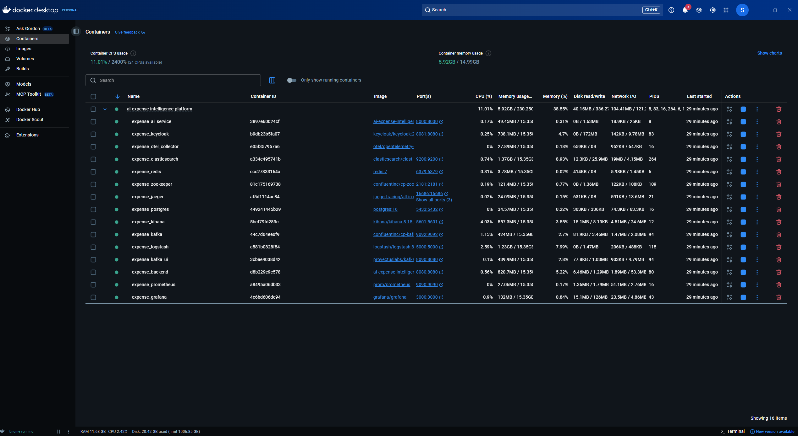
```

## Kafka UI

```text
screenshots/kafka-ui.png
```

```md
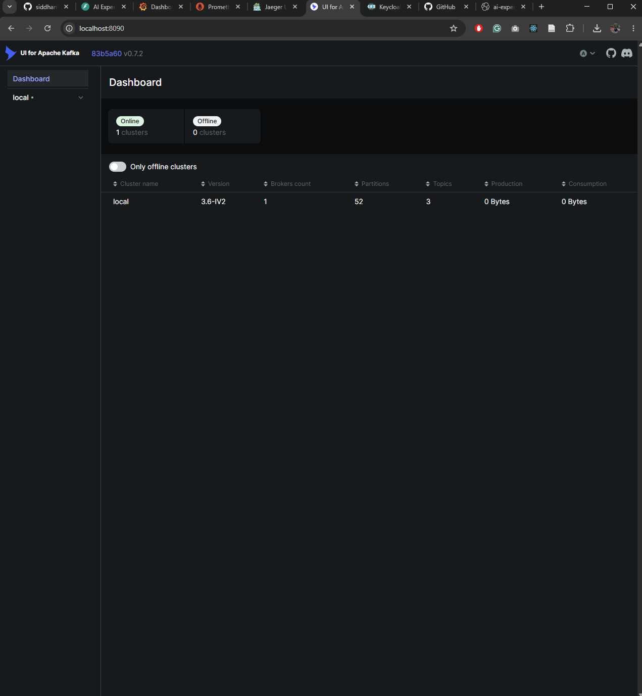
```

## Kafka DLT Topic

```text
screenshots/kafka-dlt-topic.png
```

```md

```

## Prometheus Metrics

```text
screenshots/prometheus-metrics.png
```

```md

```

## Grafana Dashboard

```text
screenshots/grafana-dashboard.png
```

```md
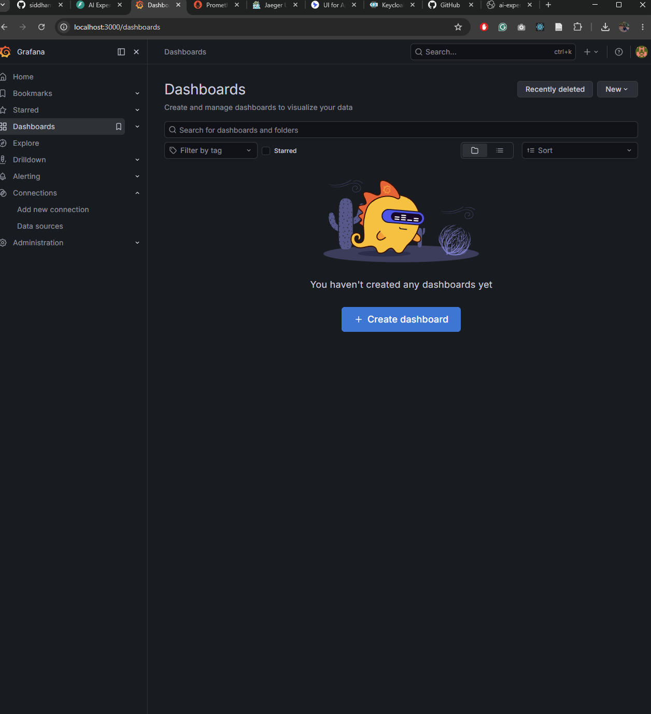
```

## Jaeger Traces

```text
screenshots/jaeger-tracing.png
```

```md
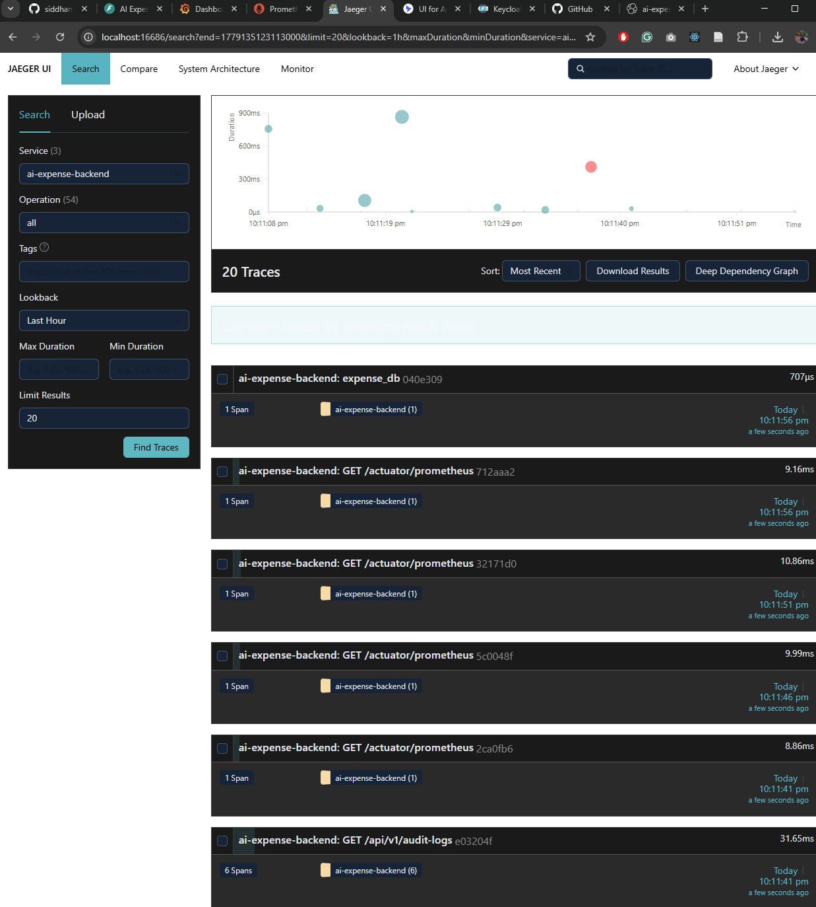
```

## Kibana Logs

```text
screenshots/kibana-logs.png
```

```md
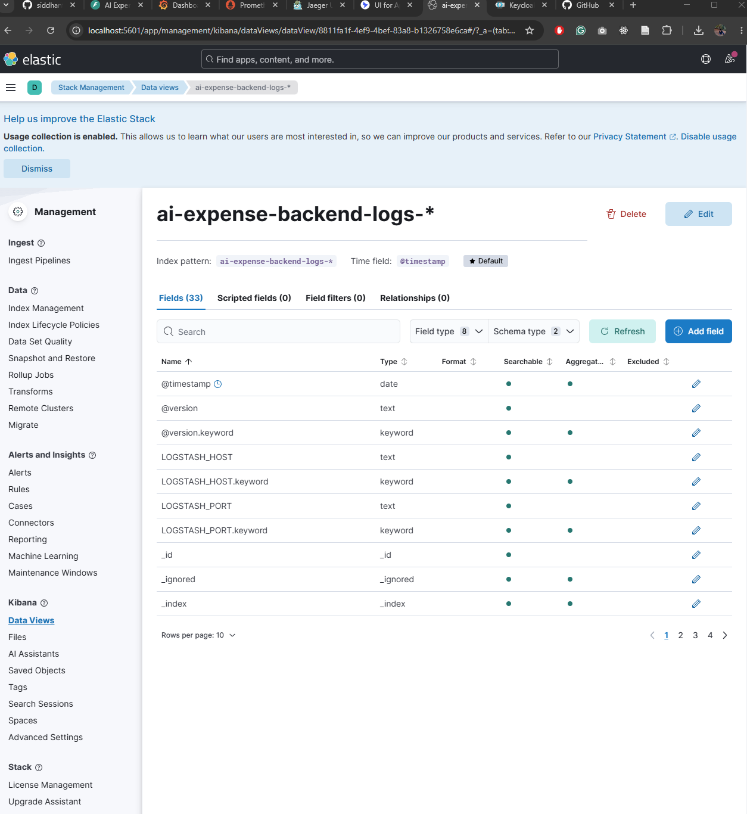
```

## Keycloak Realm

```text
screenshots/keycloak-realm.png
```

```md

```

---

# Screenshot Preview Section

## Spring Boot Swagger UI


---

## FastAPI Docs


---

## Docker Containers


---

## Kafka UI


---

## Kafka Dead Letter Topic


---

## Prometheus Metrics


---

## Grafana Dashboard


---

## Jaeger Distributed Tracing


---

## Kibana Logs


---

## Keycloak Realm


---

# Postman Collection

The repository includes a Postman collection for API testing.

## Collection File

```text
AI-Expense-Intelligence-Platform.postman_collection.json
```

## Collection Includes

- Backend health check
- FastAPI health check
- Admin token generation
- User creation
- Organization creation
- Member addition
- Expense creation
- Analytics summary
- Category breakdown
- AI spending insights
- Audit log retrieval
- AI category preview
- AI anomaly check

## Recommended Postman Flow

1. Run `Generate Admin Token`
2. Run `Create User`
3. Run `Create Organization`
4. Run `Add Organization Member`
5. Run `Create Expense`
6. Run analytics requests
7. Run audit log request

The collection stores important IDs automatically using Postman variables.

---

# Final Demo Checklist

Before recording a demo or taking screenshots:

```powershell
docker compose down

docker compose up -d
```

Then verify:

```powershell
docker ps
```

Run:

```powershell
Invoke-RestMethod -Uri "http://localhost:8080/api/v1/health" -Method GET

Invoke-RestMethod -Uri "http://localhost:8000/health" -Method GET
```

Then open:

```text
http://localhost:8080/swagger-ui.html
http://localhost:8000/docs
http://localhost:8090
http://localhost:9090
http://localhost:3000
http://localhost:5601
http://localhost:16686
```

---

# Engineering Concepts Demonstrated

This project demonstrates:

- Enterprise backend architecture
- Microservices architecture
- Event-driven architecture
- Kafka retry and DLT handling
- OAuth2 and JWT security
- Keycloak authentication
- REST API design
- DTO-based architecture
- PostgreSQL persistence
- Redis caching
- AI service integration
- Resilience4j circuit breaker pattern
- WebSocket live updates
- OpenTelemetry tracing
- Prometheus metrics
- Grafana dashboards
- Centralized logging with ELK
- Docker Compose infrastructure
- Kubernetes orchestration
- Helm packaging
- Terraform infrastructure scaffold
- Cloud-native backend design

---

# Future Improvements

## Cloud Deployment

- Google Cloud Run deployment
- GCP Artifact Registry
- Managed PostgreSQL
- Managed Redis
- Production Keycloak replacement
- HTTPS domain setup

## Testing

- Testcontainers integration tests
- Kafka integration tests
- Security tests
- API contract tests

## CI/CD

- GitHub Actions pipeline
- Docker image publishing
- Helm chart validation
- Terraform validation

## Frontend

- React dashboard
- Expense charts
- Live WebSocket notifications
- Admin analytics UI

---

# Author

Siddhant Sharma

- MSc Information Technology
- University of Stuttgart
- Backend Software Engineer with 2+ years of industry experience

